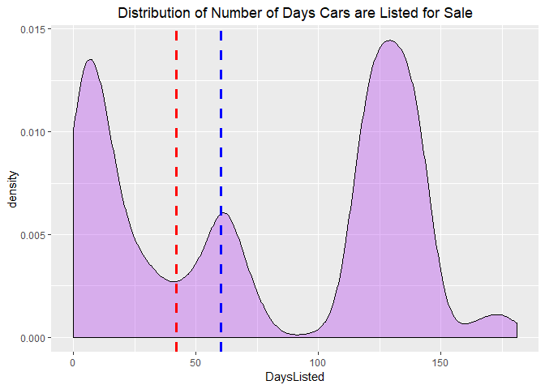
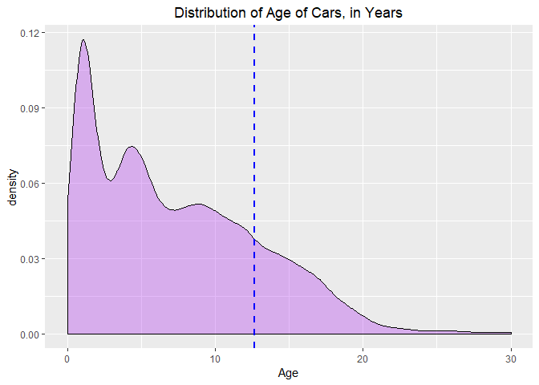
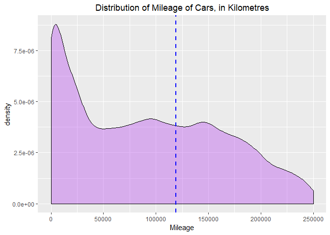
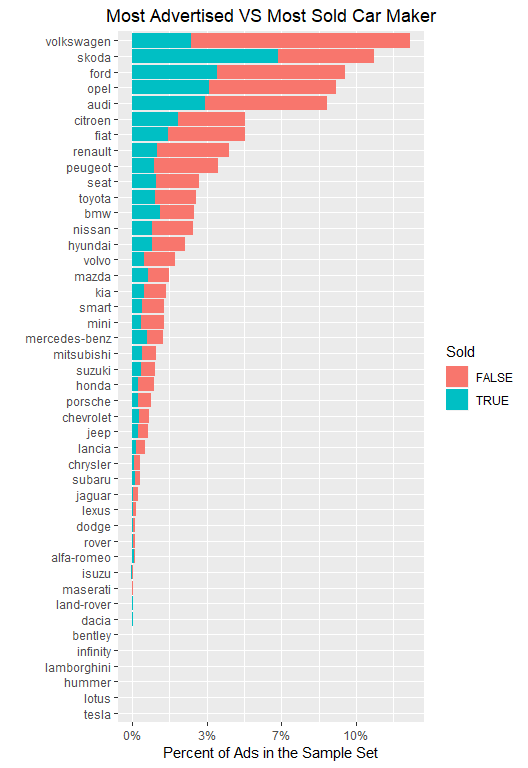
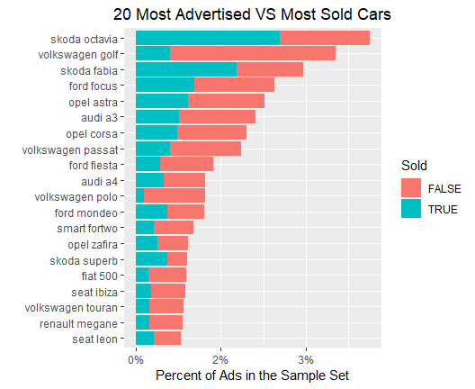
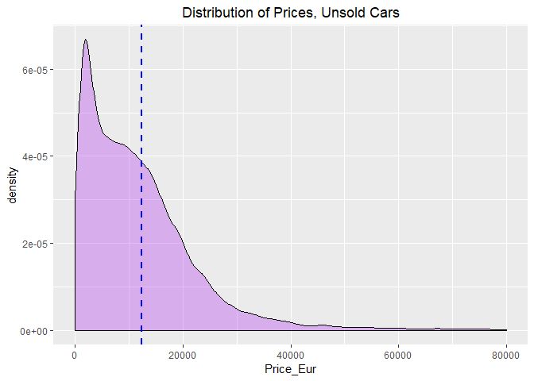
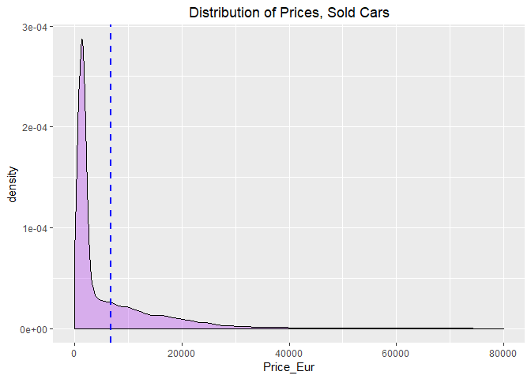
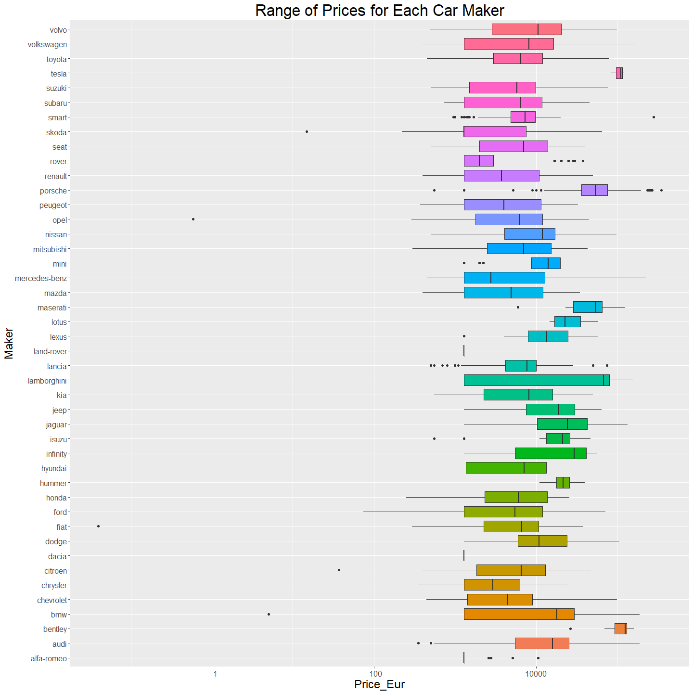

Classified Ads for Cars
=======================

Preparation of Data
-------------------

``` r
#import necessary libraries
library(ggplot2)
library(reshape2)
library(plyr)
library(readr)
library(data.table)
library(knitr)
library(kableExtra)
library(dplyr)
set.seed(42)
```

``` r
#read classified car ads data into a dataframe
data <- read.csv("~/Portfolio/classified_car_ads/data/cars.sample.csv", row.names=1)
```

``` r
#load the column names into a variable called column_names and apply it to the dataset
column_names = c("Maker","Model","Mileage","Manufacture_Year","Engine_Displacement","Engine_Power","Body_Type","Color_Slug","STK_Year","Transmission","Door_Count","Seat_Count","Fuel_Type","Date_Created","Date_Last_Seen","Price_Eur")

names(data) = column_names
```

<table class="table" style="margin-left: auto; margin-right: auto;">
<thead>
<tr>
<th style="text-align:left;">
Maker
</th>
<th style="text-align:left;">
Model
</th>
<th style="text-align:right;">
Mileage
</th>
<th style="text-align:right;">
Manufacture\_Year
</th>
<th style="text-align:right;">
Engine\_Displacement
</th>
<th style="text-align:right;">
Engine\_Power
</th>
<th style="text-align:left;">
Body\_Type
</th>
<th style="text-align:left;">
Color\_Slug
</th>
<th style="text-align:left;">
STK\_Year
</th>
<th style="text-align:left;">
Transmission
</th>
<th style="text-align:right;">
Door\_Count
</th>
<th style="text-align:right;">
Seat\_Count
</th>
<th style="text-align:left;">
Fuel\_Type
</th>
<th style="text-align:left;">
Date\_Created
</th>
<th style="text-align:left;">
Date\_Last\_Seen
</th>
<th style="text-align:right;">
Price\_Eur
</th>
</tr>
</thead>
<tbody>
<tr>
<td style="text-align:left;">
skoda
</td>
<td style="text-align:left;">
citigo
</td>
<td style="text-align:right;">
10349
</td>
<td style="text-align:right;">
2014
</td>
<td style="text-align:right;">
1000
</td>
<td style="text-align:right;">
44
</td>
<td style="text-align:left;">
</td>
<td style="text-align:left;">
</td>
<td style="text-align:left;">
None
</td>
<td style="text-align:left;">
auto
</td>
<td style="text-align:right;">
5
</td>
<td style="text-align:right;">
4
</td>
<td style="text-align:left;">
gasoline
</td>
<td style="text-align:left;">
2015-11-14 18:54:16.065
</td>
<td style="text-align:left;">
2016-01-27 20:40:15.463
</td>
<td style="text-align:right;">
8142.12
</td>
</tr>
<tr>
<td style="text-align:left;">
fiat
</td>
<td style="text-align:left;">
marea
</td>
<td style="text-align:right;">
300017
</td>
<td style="text-align:right;">
2000
</td>
<td style="text-align:right;">
1581
</td>
<td style="text-align:right;">
76
</td>
<td style="text-align:left;">
</td>
<td style="text-align:left;">
</td>
<td style="text-align:left;">
None
</td>
<td style="text-align:left;">
man
</td>
<td style="text-align:right;">
5
</td>
<td style="text-align:right;">
5
</td>
<td style="text-align:left;">
gasoline
</td>
<td style="text-align:left;">
2015-11-14 18:55:23.485
</td>
<td style="text-align:left;">
2016-01-27 20:40:15.463
</td>
<td style="text-align:right;">
736.49
</td>
</tr>
<tr>
<td style="text-align:left;">
skoda
</td>
<td style="text-align:left;">
octavia
</td>
<td style="text-align:right;">
145665
</td>
<td style="text-align:right;">
2003
</td>
<td style="text-align:right;">
1595
</td>
<td style="text-align:right;">
75
</td>
<td style="text-align:left;">
</td>
<td style="text-align:left;">
</td>
<td style="text-align:left;">
None
</td>
<td style="text-align:left;">
man
</td>
<td style="text-align:right;">
5
</td>
<td style="text-align:right;">
5
</td>
<td style="text-align:left;">
gasoline
</td>
<td style="text-align:left;">
2015-11-14 18:55:29.401
</td>
<td style="text-align:left;">
2016-01-27 20:40:15.463
</td>
<td style="text-align:right;">
4276.65
</td>
</tr>
<tr>
<td style="text-align:left;">
skoda
</td>
<td style="text-align:left;">
citigo
</td>
<td style="text-align:right;">
9800
</td>
<td style="text-align:right;">
2015
</td>
<td style="text-align:right;">
999
</td>
<td style="text-align:right;">
44
</td>
<td style="text-align:left;">
</td>
<td style="text-align:left;">
</td>
<td style="text-align:left;">
None
</td>
<td style="text-align:left;">
man
</td>
<td style="text-align:right;">
5
</td>
<td style="text-align:right;">
4
</td>
<td style="text-align:left;">
gasoline
</td>
<td style="text-align:left;">
2015-11-14 18:55:33.465
</td>
<td style="text-align:left;">
2016-01-27 20:40:15.463
</td>
<td style="text-align:right;">
7768.32
</td>
</tr>
<tr>
<td style="text-align:left;">
kia
</td>
<td style="text-align:left;">
sportage
</td>
<td style="text-align:right;">
1
</td>
<td style="text-align:right;">
2001
</td>
<td style="text-align:right;">
1998
</td>
<td style="text-align:right;">
61
</td>
<td style="text-align:left;">
</td>
<td style="text-align:left;">
</td>
<td style="text-align:left;">
None
</td>
<td style="text-align:left;">
man
</td>
<td style="text-align:right;">
5
</td>
<td style="text-align:right;">
5
</td>
<td style="text-align:left;">
diesel
</td>
<td style="text-align:left;">
2015-11-14 18:55:35.467
</td>
<td style="text-align:left;">
2016-01-27 20:40:15.463
</td>
<td style="text-align:right;">
1813.47
</td>
</tr>
<tr>
<td style="text-align:left;">
skoda
</td>
<td style="text-align:left;">
superb
</td>
<td style="text-align:right;">
234000
</td>
<td style="text-align:right;">
2002
</td>
<td style="text-align:right;">
1900
</td>
<td style="text-align:right;">
96
</td>
<td style="text-align:left;">
</td>
<td style="text-align:left;">
</td>
<td style="text-align:left;">
None
</td>
<td style="text-align:left;">
</td>
<td style="text-align:right;">
4
</td>
<td style="text-align:right;">
5
</td>
<td style="text-align:left;">
diesel
</td>
<td style="text-align:left;">
2015-11-14 18:55:35.74
</td>
<td style="text-align:left;">
2016-01-27 20:40:15.463
</td>
<td style="text-align:right;">
3293.86
</td>
</tr>
</tbody>
</table>
``` r
#summary of all attributes in the dataset
summary(data)
```

    ##         Maker           Model          Mileage        Manufacture_Year
    ##  volkswagen: 3722   octavia: 1374   Min.   :      0   Min.   :   0    
    ##  skoda     : 3246   golf   : 1173   1st Qu.:  24991   1st Qu.:2005    
    ##  ford      : 2860   fabia  :  983   Median :  92000   Median :2010    
    ##  opel      : 2736   focus  :  814   Mean   : 119107   Mean   :2004    
    ##  audi      : 2610   astra  :  758   3rd Qu.: 159000   3rd Qu.:2014    
    ##  citroen   : 1520   a3     :  703   Max.   :9193000   Max.   :2017    
    ##  (Other)   :13264   (Other):24153                                     
    ##  Engine_Displacement  Engine_Power           Body_Type       Color_Slug   
    ##  Min.   :   25       Min.   : 10.00   other       :18279          :27414  
    ##  1st Qu.: 1390       1st Qu.: 66.00               : 7890   black  :  521  
    ##  Median : 1598       Median : 81.00   stationwagon: 1035   white  :  475  
    ##  Mean   : 1869       Mean   : 92.28   coupe       :  954   blue   :  465  
    ##  3rd Qu.: 1984       3rd Qu.:105.00   compact     :  832   silver :  402  
    ##  Max.   :32000       Max.   :900.00   van         :  391   red    :  270  
    ##  NA's   :4827        NA's   :2923     (Other)     :  577   (Other):  411  
    ##     STK_Year     Transmission   Door_Count      Seat_Count    
    ##         :16502       : 4756   Min.   :0.000   Min.   : 0.000  
    ##  None   : 8406   auto: 5656   1st Qu.:4.000   1st Qu.: 5.000  
    ##  2018   : 1821   man :19546   Median :4.000   Median : 5.000  
    ##  2017   : 1718                Mean   :4.114   Mean   : 4.903  
    ##  2016   : 1213                3rd Qu.:5.000   3rd Qu.: 5.000  
    ##  2019   :  280                Max.   :6.000   Max.   :56.000  
    ##  (Other):   18                NA's   :6979    NA's   :8536    
    ##     Fuel_Type                      Date_Created  
    ##          :17276   2015-11-14 18:54:16.065:    1  
    ##  cng     :   12   2015-11-14 18:55:23.485:    1  
    ##  diesel  : 5879   2015-11-14 18:55:29.401:    1  
    ##  electric:  269   2015-11-14 18:55:33.465:    1  
    ##  gasoline: 6464   2015-11-14 18:55:35.467:    1  
    ##  lpg     :   58   2015-11-14 18:55:35.74 :    1  
    ##                   (Other)                :29952  
    ##                  Date_Last_Seen    Price_Eur     
    ##  2016-01-27 20:40:15.463:  988   Min.   :     0  
    ##  2015-12-13 12:00:23.78 :    1   1st Qu.:  1295  
    ##  2015-12-13 12:01:00.292:    1   Median :  6903  
    ##  2015-12-13 12:01:03.84 :    1   Mean   : 10300  
    ##  2015-12-13 12:01:06.072:    1   3rd Qu.: 14591  
    ##  2015-12-13 12:01:56.052:    1   Max.   :349103  
    ##  (Other)                :28965

``` r
#data type of each attribute
str(data)
```

    ## 'data.frame':    29958 obs. of  16 variables:
    ##  $ Maker              : Factor w/ 44 levels "alfa-romeo","audi",..: 37 10 37 37 19 37 42 14 37 11 ...
    ##  $ Model              : Factor w/ 680 levels "100","100-nx",..: 205 409 449 205 573 582 140 347 287 428 ...
    ##  $ Mileage            : num  10349 300017 145665 9800 1 ...
    ##  $ Manufacture_Year   : int  2014 2000 2003 2015 2001 2002 2013 2012 2002 2012 ...
    ##  $ Engine_Displacement: int  1000 1581 1595 999 1998 1900 1998 1400 1900 1997 ...
    ##  $ Engine_Power       : int  44 76 75 44 61 96 91 73 74 103 ...
    ##  $ Body_Type          : Factor w/ 10 levels "","compact","convertible",..: 1 1 1 1 1 1 1 1 1 1 ...
    ##  $ Color_Slug         : Factor w/ 15 levels "","beige","black",..: 1 1 1 1 1 1 1 1 1 1 ...
    ##  $ STK_Year           : Factor w/ 11 levels "","2015","2016",..: 11 11 11 11 11 11 11 11 11 11 ...
    ##  $ Transmission       : Factor w/ 3 levels "","auto","man": 2 3 3 3 3 1 3 3 3 3 ...
    ##  $ Door_Count         : int  5 5 5 5 5 4 5 5 5 5 ...
    ##  $ Seat_Count         : int  4 5 5 4 5 5 5 5 5 5 ...
    ##  $ Fuel_Type          : Factor w/ 6 levels "","cng","diesel",..: 5 5 5 5 3 3 3 5 3 3 ...
    ##  $ Date_Created       : Factor w/ 29958 levels "2015-11-14 18:54:16.065",..: 1 2 3 4 5 6 7 8 9 10 ...
    ##  $ Date_Last_Seen     : Factor w/ 28971 levels "2015-12-13 12:00:23.78",..: 5113 5113 5113 5113 5113 5113 5113 5113 5113 5113 ...
    ##  $ Price_Eur          : num  8142 736 4277 7768 1813 ...

Data Discovery
--------------

For easier understanding, I introduced several new columns, ListedTS, RemovedTS, DaysListed and Age. ListedTS and RemovedTS are timestamped values of when the cars are first listed for sale and when they are finally removed. DaysListed represents the number of days a car has been listed for sale in an ad, calculated as the difference between RemovedTS and ListedTS. The Age column shows how old, in days, the car is (since the Manufacture Year).

``` r
#replace the Date_Created and Date_Last_Seen columns with timestamped values: ListedTS and Removed TS
data$ListedTS = strptime(data$Date_Created, '%Y-%m-%d %H:%M:%OS')
data$RemovedTS = strptime(data$Date_Last_Seen, '%Y-%m-%d %H:%M:%OS')

#new column called DaysListed, that finds the number of days a car has been listed in ads
data$DaysListed = as.integer(ceiling(
  difftime(data$RemovedTS, data$ListedTS, units = "days")))

#new column called Age, that finds out the age of a particular listed car
data$Age = as.integer(ceiling(
  difftime(data$ListedTS, strptime(data$Manufacture_Year,'%Y'), units = "days")/365))
```

In the figure below we can see the distribution of the number of days cars are listed for sale. We found it reasonable to assume that cars listed for no longer than 42 days were sold, due to the drop in the number of ads at this point after the initial peak, which suggests that many of these cars were sold and had their ads removed. This date is represented by the red line, whereas the blue line represents the 60-day limit that was used by car ad agencies to remove car listings after this point. Any cars that were listed for more than 60 days had to be relisted for the same number of days.

``` r
#the distribution of the number of days cars are listed for sale
ggplot(data, aes(x=DaysListed)) + 
  geom_density(fill="darkorchid2", alpha=.35) +
  geom_vline(aes(xintercept=42), color="red", linetype="dashed", size=1.3)+
  geom_vline(aes(xintercept=60), color="blue", linetype="dashed", size=1.3)+
  ggtitle("Distribution of Number of Days Cars are Listed for Sale")+
  theme(plot.title = element_text(hjust = 0.5))
```



This leads us to creating a new attribute called Sold, which represents whether a car has been sold or not, to be used for our analysis.

``` r
data$Sold = data$DaysListed <= 42
```

Age is a significant characteristic of a car listed for sale. Looking at the distribution of age in years among the cars, we can see that the average age, as shown by the blue line, is 12 years. The most frequently listed cars are under a year old.

``` r
ggplot(data, aes(x=Age)) + 
  geom_density(fill="darkorchid2", alpha=.35) +
  scale_x_continuous(limits = c(0, 30))+
  geom_vline(aes(xintercept=mean(Age, na.rm=T)),color="blue", linetype="dashed", size=1)+
  ggtitle("Distribution of Age of Cars, in Years")+
  theme(plot.title = element_text(hjust = 0.5))
```



Mileage is another important feature, the distribution of which we plotted below. The average mileage (blue line) has a value of about 120,000 km. Note that the most frequently listed vehicles have a low mileage that is below 25,000 km.

``` r
ggplot(data, aes(x=Mileage)) + 
  geom_density(fill="darkorchid2", alpha=.35) +
  scale_x_continuous(limits = c(0, 250000))+
  geom_vline(aes(xintercept=mean(Mileage, na.rm=T)), color="blue", linetype="dashed", size=1)+
  ggtitle("Distribution of Mileage of Cars, in Kilometres")+
  theme(plot.title = element_text(hjust = 0.5))
```



Another important question is to know what car brands are most advertised in the classifieds, and, given this information, compare how well they tend to sell. In the chart below we can see that the most advertised car brand is Volkswagen, but the top-selling brand is Skoda. Interestingly, Volkswagen is not close to being first place in terms of sales despite its dominant presence in the ads.

``` r
require(forcats)
total <- nrow(data)
ggplot(data, aes(fct_rev(fct_infreq(Maker)), fill=Sold)) +
  geom_bar() +
  labs(x="", y="Percent of Ads in the Sample Set") +
  scale_y_continuous(labels = function(x) sprintf("%.0f%%",x/total*100)) +
  coord_flip() +
  ggtitle("Most Advertised VS Most Sold Car Maker") +
  theme(plot.title = element_text(hjust = 0.5))
```



We also would like to know which car models appear in ads most frequently, and to compare their sales. From the chart, it appears that Skoda Octavia is the most advertised and the best-selling model. On the other hand, the Volkswagen Golf is listed almost as much as the Octavia, but it is one of the least popular cars overall.

``` r
require(forcats)
total <- nrow(data)
data$Car <- paste(data$Maker, data$Model)
bestCarsList <- fct_infreq(data$Car)
data.bestCars <- data[data$Car %in%  levels(bestCarsList)[1:20],]
ggplot(data.bestCars, aes(fct_rev(fct_infreq(Car)), fill=Sold)) +
  geom_bar() + 
  labs(x="", y="Percent of Ads in the Sample Set") +
  scale_y_continuous(labels = function(x) sprintf("%.0f%%",x/total*100)) + 
  coord_flip() + 
  ggtitle("20 Most Advertised VS Most Sold Cars") +
  theme(plot.title = element_text(hjust = 0.5))
```



Another question we would like to answer is how the price of the cars is distributed among those sold and unsold. For those sold, the price most frequently asked for and paid is 1,295.34 Euros.

``` r
ggplot(data[!(data$Sold),], aes(x=Price_Eur)) + 
  geom_density(fill="darkorchid2", alpha=.35) +
  scale_x_continuous(limits = c(0, 80000)) +
  geom_vline(aes(xintercept=mean(Price_Eur, na.rm=T)), color="blue", linetype="dashed", size=1) +
  ggtitle("Distribution of Prices, Unsold Cars") +
  theme(plot.title = element_text(hjust = 0.5))
```



``` r
ggplot(data[data$Sold,], aes(x=Price_Eur)) + 
  geom_density(fill="darkorchid2", alpha=.35) +
  scale_x_continuous(limits = c(0, 80000)) +
  geom_vline(aes(xintercept=mean(Price_Eur, na.rm=T)), color="blue", linetype="dashed", size=1) + 
  ggtitle("Distribution of Prices, Sold Cars") +
  theme(plot.title = element_text(hjust = 0.5))
```



``` r
ggplot(data, aes(x=Maker, y=Price_Eur, fill=Maker)) +  
  geom_boxplot() +
  guides(fill=FALSE, color=FALSE)+
  scale_y_log10(labels = function(x) format(x, scientific = FALSE)) +
  coord_flip() +
  ggtitle("Range of Prices for Each Car Maker") +
  theme(plot.title = element_text(hjust = 0.5, size=25)) +
  theme(axis.text=element_text(size=12), axis.title=element_text(size=18))
```



Conclusion
----------

The analysis of this dataset was performed in R Studio. Throughout the data exploration and discovery the dataset was cleaned of outliers and engineered with new columns such as ListedTS, RemovedTS, Age and Sold. Important questions pertinent to this data were identified, such as the distribution of listed cars' age and mileage, the most advertised versus the most sold car brands and models, the distribution of car prices and the price of the best-selling cars were calculated.
